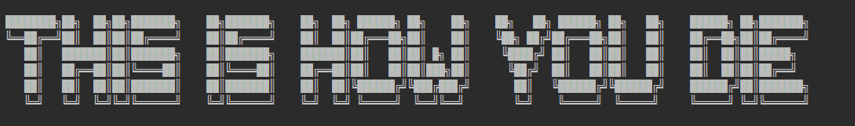
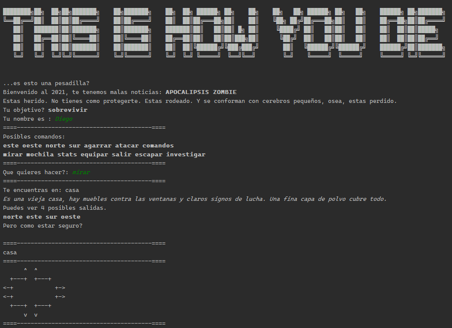

---
Para empezar a jugar simplemente elegir el universo en el que queremos jugar (Por ahora: zombies o vampiros).

Para jugar, simplemente intentar interactuar en las situaciones que se presentan con esta (*en un principio*) lista de comandos.
```
este, oeste, norte, sur, agarrar, atacar, 
comandos, mirar, mochila, stats, equipar, 
salir, escapar, investigar.
```
En el mundo encontraran enemigos, armas e items que te ayudaran (o no) a sobrevivir lo mas que puedas.

Sobre el juego
---


- Tp final de la materia Paradigmas de la Programación.
- La idea del juego es sobrevivir lo más posible, investigando, peleando y con algo de suerte.
